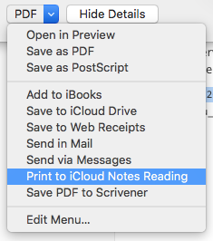

# Print to Apple Notes iCloud

Adds a print service that allows any application to print directly into a shared Notes App note.

This uses AppleScript and automator to make it easy to export a web page or any printable document to the Apple Notes App, which (via iCloud) can then sync across devices.

## Setup

1. Create a new Print Service in Automator.

2. Add the *Run AppleScript* Action.

3. Paste in the contents of `Print to iCloud Notes Reading.applescript`

   You may wish to modify the Account and Folder the Note will be created in.

4. Save the Script as `Print to iCloud Notes Reading`

   This file will be saved in your `~/Library/PDF Services` folder.

The print service can now be accessed from the standard macOS print window by clicking on the `PDF` menu button:

This can be further automated by following [these instructions to set up a keyboard shortcut](https://www.macsparky.com/blog/2008/3/19/keyboard-shortcut-for-save-as-pdf-in-os-x.html) in system preferences.

1. Open *System Preferences*, select *Keyboard* and then the *Shortcuts* tab.

2. Select *App Shortcuts* on the left and then create a new entry under *All Applications*: 

3. Set the Menu Title to `Print to iCloud Notes Reading` (as used above), and the keyboard shortcut to ⌘P. 

   *Despite the seeming conflict, this combintation will work!*

It now should be possible to quickly export to Notes with the keyboard sequence ⌘P, ⌘P. **Note that for some applications, if the second ⌘P is issued before the print dialog has properly loaded, it will produce a blank PDF.**

